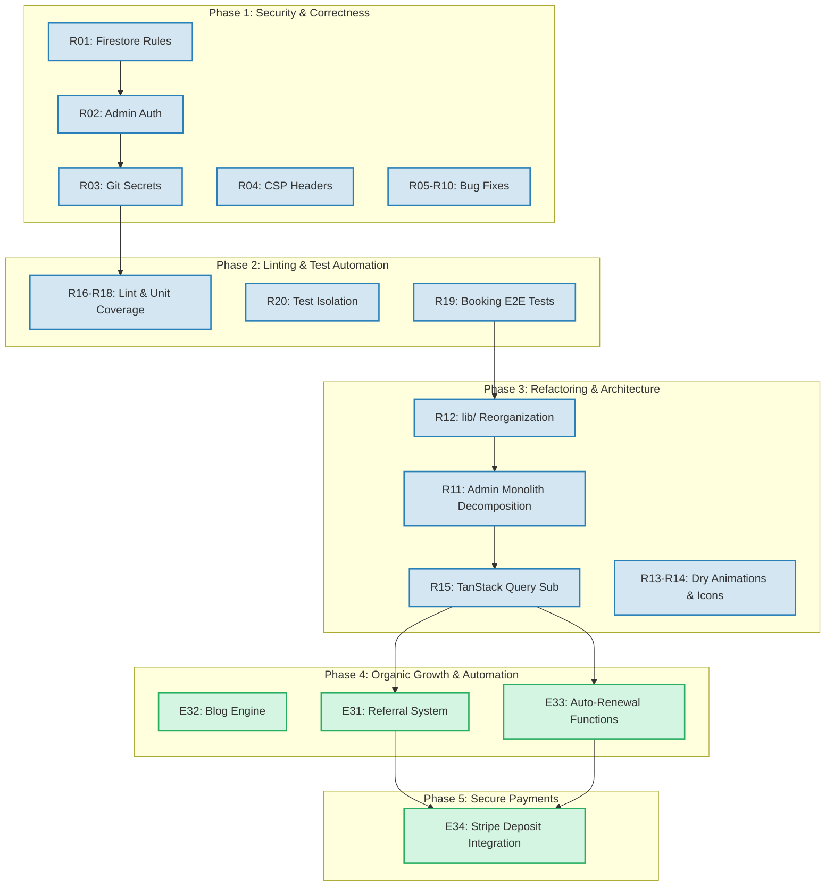

# Fresh Nest Co. — Unified Development Roadmap v1
### Integrating Master Plan v2 (Growth) & Architectural Remediation v1 (Security/DX)
**Version:** 1.0 · **Date:** June 2026  
**Status:** Pending Approval  
**Base Plans:** [MasterPlan v2](file:///workspaces/fresh_nest/docs/FreshNestCo_MasterPlan_v2.md) & [ArchRemediation v1](file:///workspaces/fresh_nest/docs/FreshNestCo_ArchRemediation_Plan_v1.md)

---

## Executive Summary

This unified plan merges the remaining growth epics from the Master Plan with the complete list of architectural, security, and developer experience (DX) fixes from the Remediation Plan.

By sequencing **remediation before feature expansion**, we align our development with the following priorities:
1. **Critical Security First**: All Firestore PII is protected, secrets are removed from version control, and CSP headers are deployed before new user features are introduced.
2. **Automated Confidence**: E2E test coverage for the booking form and strict type-aware lint rules are established as a quality gate before any refactoring or major coding begins.
3. **Refactoring as a Velocity Multiplier**: Decoupling code monoliths and adopting TanStack Query simplifies the codebase, making it much easier to implement upcoming database-reliant growth features.
4. **Cohesive Feature Delivery**: New features are built on a solid, secure, and modular foundation, avoiding double-work and codebase regressions.

---

## The 5-Phase Unified Roadmap

---

### Phase 1 — Critical Security Hardening & Low-Hanging Correctness Fixes
**Priority:** Immediate (P0)  
**Goal:** Lock down Firestore PII, remove secrets from GitHub tracking, deploy a CSP, and resolve existing user-facing bugs.  
**Deployment Policy:** Continuous deployment. Each security epic must be pushed and verified in production immediately upon passing the AGY gate. Do not batch.

*   **[R01 — Firestore Security Rules (Production)](file:///workspaces/fresh_nest/docs/projects/R01_firestore-rules.md) [Security]**
    *   *Details*: Establish strict read/write authorization. Move to deny-by-default for all collections, whitelist public write on `bookings` (with schema validation), and restrict read/update to Google Auth identities present in a private `admins` collection.
    *   *Primary Persona*: Diane, Travis, Margaret (PII Protection)
    *   *Verification*: REST API requests without auth fail with a `403`.
*   **[R02 — Admin Authorization: Server-Side Enforcement](file:///workspaces/fresh_nest/docs/projects/R02_admin-auth-serverside.md) [Security]**
    *   *Details*: Replace the client-side `VITE_ADMIN_EMAILS` check in [AdminPage.tsx](file:///workspaces/fresh_nest/src/pages/AdminPage.tsx) with a database check against the `admins` collection.
    *   *Primary Persona*: Ryan (Owner)
*   **[R03 — Remove `.env.production` From Version Control](file:///workspaces/fresh_nest/docs/decisions/ADR-008-secrets-management.md) [Security]**
    *   *Details*: Untrack `.env.production` in git, add to `.gitignore`, and transition environment configurations exclusively to GitHub Secrets.
    *   *Primary Persona*: Ryan (Owner)
*   **[R04 — Content-Security-Policy Header](file:///workspaces/fresh_nest/docs/projects/R04_csp-header.md) [Security]**
    *   *Details*: Add a strong CSP to [firebase.json](file:///workspaces/fresh_nest/firebase.json) to mitigate XSS and injection vectors.
    *   *Primary Persona*: Ryan (Owner)
*   **[R05 — Fix `MIN_DATE` / `MAX_DATE` Module-Level Constants](file:///workspaces/fresh_nest/docs/projects/R05_mindate-fix.md) [Correctness]**
    *   *Details*: Move `MIN_DATE` and `MAX_DATE` calculations inside the [BookingStep2.tsx](file:///workspaces/fresh_nest/src/components/booking/BookingStep2.tsx) render cycle to prevent stale dates.
    *   *Primary Persona*: Travis (P2), Sophie (P5)
*   **[R06 — Fix Footer Cornwall Location Link](file:///workspaces/fresh_nest/docs/projects/R06_footer-link-fix.md) [Correctness]**
    *   *Details*: Correct the Cornwall link in [Footer.tsx](file:///workspaces/fresh_nest/src/components/layout/Footer.tsx) from `/locations/cornwall` to `/locations/cornwall-on` (resolving a silent redirect).
    *   *Primary Persona*: Kahnawà:ke (P4), Travis (P2)
*   **[R07 — Add Missing Booking Status i18n Keys](file:///workspaces/fresh_nest/docs/projects/R07_missing-i18n-keys.md) [Correctness]**
    *   *Details*: Add `completed` and `cancelled` keys to French and English translation sheets, preventing raw keys displaying in the dashboard.
    *   *Primary Persona*: Ryan (Owner)
*   **[R08 — Fix `QuoteCalculator` Animation Trigger](file:///workspaces/fresh_nest/docs/projects/R08_calculator-animation-fix.md) [Correctness]**
    *   *Details*: Switch the Framer Motion trigger in [QuoteCalculator.tsx](file:///workspaces/fresh_nest/src/components/home/QuoteCalculator.tsx) to `whileInView` to prevent it from animating offscreen.
    *   *Primary Persona*: Travis (P2), Sophie (P5)
*   **[R09 — Remove Stale Repository Artifacts](file:///workspaces/fresh_nest/docs/projects/R09_repo-cleanup.md) [DX]**
    *   *Details*: Delete obsolete root Python helper scripts and replace the default Vite `README.md` with comprehensive project documentation.
    *   *Primary Persona*: Dev Team
*   **[R10 — Document `onDailyReminderCheck` DB Asymmetry](file:///workspaces/fresh_nest/docs/projects/R10_scheduler-db-doc.md) [DX/Correctness]**
    *   *Details*: Explicitly target `(default)` in the reminder Cloud Function call to document database routing and safeguard test numbers in `freshnest-dev`.
    *   *Primary Persona*: Ryan (Owner)

---

### Phase 2 — Tooling Upgrades & E2E Test Automation (Quality Gates)
**Priority:** High (P1)  
**Goal:** Automate quality gates with ESLint type-checking, establish test coverage baselines, and safeguard the critical booking funnel before refactoring.

*   **[R16 — Enable Type-Aware ESLint Rules](file:///workspaces/fresh_nest/docs/projects/R16_eslint-type-aware.md) [Tooling]**
    *   *Details*: Upgrade [eslint.config.js](file:///workspaces/fresh_nest/eslint.config.js) to use `recommendedTypeChecked`. Fix type errors.
    *   *Primary Persona*: Dev Team
*   **[R17 — Wire `@tanstack/eslint-plugin-query`](file:///workspaces/fresh_nest/docs/projects/R17_eslint-query-plugin.md) [Tooling]**
    *   *Details*: Enable query-specific lint checks to prevent anti-patterns before implementing TanStack hooks.
    *   *Primary Persona*: Dev Team
*   **[R18 — Add Vitest Coverage Threshold](file:///workspaces/fresh_nest/docs/projects/R18_coverage-threshold.md) [Tooling]**
    *   *Details*: Configure a 40% code coverage threshold in [vitest.config.ts](file:///workspaces/fresh_nest/vitest.config.ts) to prevent regressions.
    *   *Primary Persona*: Dev Team
*   **[R20 — Fix Analytics Singleton Test Isolation](file:///workspaces/fresh_nest/docs/projects/R20_analytics-test-isolation.md) [Tooling]**
    *   *Details*: Export a test-only reset function in `analytics.ts` to isolate mock tracking between test suites.
    *   *Primary Persona*: Dev Team
*   **[R19 — Booking Form E2E Coverage](file:///workspaces/fresh_nest/docs/projects/R19_e2e-booking-coverage.md) [Tooling]**
    *   *Details*: Write Playwright E2E tests (`e2e/booking.spec.ts` & `e2e/language.spec.ts`) validating standard booking flows, back navigation, and French locale toggles.
    *   *Primary Persona*: Travis (P2), Sophie (P5), Margaret (P3)
    *   *Verification*: Test suite executes successfully in CI pipeline.

---

### Phase 3 — Architectural Refactoring & Modernization (Velocity Multiplier)
**Priority:** Medium (P1)  
**Goal:** Decompose front-end monoliths, reorganize workspace imports, and wire TanStack Query to Firebase subscriptions to enable rapid feature addition.

*   **[R12 — Reorganize `lib/` Into Sub-Directories](file:///workspaces/fresh_nest/docs/projects/R12_lib-reorganize.md) [Refactoring]**
    *   *Details*: Group static data fixtures (`data/`), Firebase configurations (`firebase/`), and utility classes (`utils/`) into logical folders. Update all imports.
    *   *Primary Persona*: Dev Team
*   **[R11 — Decompose `AdminPage.tsx` Into Composed Modules](file:///workspaces/fresh_nest/docs/projects/R11_admin-decompose.md) [Refactoring]**
    *   *Details*: Split the 650+ line [AdminPage.tsx](file:///workspaces/fresh_nest/src/pages/AdminPage.tsx) into independent custom hooks (`useAdminAuth`, `useBookings`, `useAdminAnalytics`) and modular UI components (`BookingsTable`, `BookingDetailPanel`, `AnalyticsDashboard`).
    *   *Primary Persona*: Ryan (Owner)
*   **[R15 — Wire TanStack Query to Firestore Bookings Subscription](file:///workspaces/fresh_nest/docs/projects/R15_tanstack-query-firestore.md) [Refactoring]**
    *   *Details*: Replace manual `useEffect` subscription queries in `useBookings.ts` with `useFirestoreCollection` from `@tanstack-query-firebase/react`.
    *   *Primary Persona*: Ryan (Owner)
*   **[R13 — Consolidate Framer Motion Animation Variants](file:///workspaces/fresh_nest/docs/projects/R13_animations-consolidate.md) [Refactoring]**
    *   *Details*: Extract duplicated variants (`fadeUp`, `stagger`) from 8 home section files into a single reusable module.
    *   *Primary Persona*: Dev Team
*   **[R14 — Replace `ServiceIcon` Switch Statement With a Data Map](file:///workspaces/fresh_nest/docs/projects/R14_serviceicon-map.md) [Refactoring]**
    *   *Details*: Map service keys to SVG symbols in a typed record to eliminate switch-case control logic.
    *   *Primary Persona*: Dev Team

---

### Phase 4 — Organic Growth, Referrals & Automations (Feature Epics)
**Priority:** Medium/High (P1/P2)  
**Goal:** Roll out content acquisition channels, implement referral loops, and automate future cleaning schedules.

*   **E32 — Blog & Content Engine [Feature]**
    *   *Details*: Implement a blogging routing pattern (/blog and /blog/:slug) supporting translated posts. Write 4 initial articles targeting local search queries in Cornwall and Akwesasne.
    *   *Primary Persona*: Sophie (P5), Travis (P2), SEO Reach
    *   *Verification*: Blog pages pass SEO lighthouse audits; posts are localized in FR/EN.
*   **E31 — Referral Program ("Give $20, Get $20") [Feature]**
    *   *Details*: Generates unique referral links on the thank-you screen and tracks referrers in the Firebase schema.
    *   *Primary Persona*: Margaret (P3), Diane (P1), Kahnawà:ke (P4)
    *   *Integration with Refactoring*: Add the referral analytics columns directly to the new modular components created in `R11` (`BookingsTable` and `AnalyticsDashboard`). Update Firestore schemas and rules safely under `R01` patterns.
*   **E33 — Recurring Booking Auto-Renewal [Feature/Functions]**
    *   *Details*: Create a Firebase Scheduled Cloud Function that automatically creates future cleaning bookings for clients configured with recurring frequencies (weekly, biweekly, monthly). Trigger owner notices and client confirmations.
    *   *Primary Persona*: Travis (P2), Margaret (P3)
    *   *Integration with Refactoring*: Uses the database structures documented in `R10` to safely target database instances and query with TanStack hooks in the admin view.

---

### Phase 5 — Payment Integration & Commitment Capture (Revenue Epic)
**Priority:** Post-Launch Growth (P2)  
**Goal:** Integrate checkout deposit requirements for commercial and turnover operations (Airbnb).

*   **E34 — Stripe Deposit Integration [Feature/Payments]**
    *   *Details*: Integrate Stripe elements into Step 4 of the Booking Form. Require security deposits for commercial accounts and Airbnb turnover services. Add `depositAmount` and transaction properties to Firestore booking data.
    *   *Primary Persona*: Gallagher (P6), Travis (P2)
    *   *Integration with Security/Refactoring*: Safely configure writing restrictions using rules established in `R01` (to prevent client-side modifications of payment flags). Surface Stripe payment statuses inside the modularized `BookingsTable` (`R11`).

---

## Complete Epic & Finding Directory

This directory maps every work item to its priority, target phase, files touched, and the architectural findings it resolves.

| Epic ID | Type | Epic Name | Priority | Phase | Files Touched | Addressed Finding |
| :--- | :--- | :--- | :--- | :--- | :--- | :--- |
| **R01** | Security | Firestore Rules (Prod) | Critical | 1 | `firestore.rules`, `docs/COMPLIANCE.md` | F-01 |
| **R02** | Security | Admin Auth Server-Side | Critical | 1 | `src/pages/AdminPage.tsx` | F-02 |
| **R03** | Security | Git Secrets (.env) | High | 1 | `.gitignore`, `.env.production` | F-03 |
| **R04** | Security | CSP Header Deployment | Medium | 1 | `firebase.json` | F-11 |
| **R05** | Correct | Fix Date Pickers (tomorrow) | High | 1 | `src/components/booking/BookingStep2.tsx` | F-04 |
| **R06** | Correct | Fix Footer Cornwall Link | High | 1 | `src/components/layout/Footer.tsx` | F-05 |
| **R07** | Correct | Missing i18n badges | High | 1 | `src/i18n/locales/en.json`, `fr.json` | F-06 |
| **R08** | Correct | Quote Calculator viewport | Medium | 1 | `src/components/home/QuoteCalculator.tsx` | F-07 |
| **R09** | DX | Clean root files & README | Low | 1 | Root files, `README.md` | F-08, F-09, F-21 |
| **R10** | DX | Doc reminder DB targets | Medium | 1 | `functions/src/index.ts`, `firestore-schema.md` | F-10 |
| **R16** | Tooling | Type-Aware ESLint Config | Medium | 2 | `eslint.config.js` | F-17 |
| **R17** | Tooling | TanStack Query ESLint | Low | 2 | `eslint.config.js` | F-18 |
| **R18** | Tooling | Vitest Coverage Threshold | Low | 2 | `vitest.config.ts` | F-19 |
| **R20** | Tooling | Analytics Mock Isolation | Low | 2 | `src/lib/analytics.ts` | F-22 |
| **R19** | Tooling | Booking Form E2E Tests | High | 2 | `e2e/booking.spec.ts`, `e2e/language.spec.ts` | F-20 |
| **R12** | Refactor | Reorganize `lib/` directory | Low | 3 | `src/lib/` (all files and imports) | F-13 |
| **R11** | Refactor | Decompose Admin Monolith | Medium | 3 | `src/pages/AdminPage.tsx`, `src/components/admin/*` | F-12 |
| **R15** | Refactor | Hook up TanStack Query | Medium | 3 | `src/hooks/useBookings.ts` | F-16 |
| **R13** | Refactor | Consolidate Home Animations | Low | 3 | `src/lib/animations.ts`, `src/components/home/*` | F-14 |
| **R14** | Refactor | Dry Service Icon Switch | Low | 3 | `src/components/home/ServicesGrid.tsx` | F-15 |
| **E32** | Feature | Blog & Content Engine | Medium | 4 | `src/pages/Blog.tsx`, `src/App.tsx` | N/A |
| **E31** | Feature | Referral System ($20/$20) | Medium | 4 | `src/pages/BookingPage.tsx`, `src/pages/AdminPage.tsx` | N/A |
| **E33** | Feature | Auto-Renewal Cron Function | Medium | 4 | `functions/src/index.ts` | N/A |
| **E34** | Feature | Stripe Deposit Integrations | High | 5 | `src/components/booking/*`, `functions/src/*` | N/A |

---

## Architectural Decisions Required (ADR Index)

The following architectural decisions are required before commencing their respective phases. ADR templates must be committed to `docs/decisions/` prior to implementation.

1.  **ADR-007: Firestore Database Security Rules Architecture**
    *   *Scope*: Defines the use of the `admins/{email}` document collection to authorize administration reads. Outlines the default-deny strategy.
    *   *Required Before*: **R01**
2.  **ADR-008: Environment Secret Architecture & CI Injection**
    *   *Scope*: Documents how local credentials are kept out of Git, detailing GitHub Actions injection pipelines for `dev` and `prod` targets.
    *   *Required Before*: **R03**
3.  **ADR-009: Referral Coupon Datastore & Verification Logic**
    *   *Scope*: Defines how referral codes are generated, validated, and recorded in Firestore without compromising security.
    *   *Required Before*: **E31**
4.  **ADR-010: Stripe Integration & Transaction Webhook State Machine**
    *   *Scope*: Establishes how checkout sessions are initiated, payments are captured, and deposits are recorded on bookings.
    *   *Required Before*: **E34**

---

## Compliance & Persona Verification Checklist

To complete each Phase, the following persona test and technical checks must pass.

### Phase 1: Security & Correctness
*   [ ] **R01 REST Gate**: Running `curl https://firestore.googleapis.com/v1/projects/freshnest-aa51e/databases/default/documents/bookings` returns a `403 Forbidden` error.
*   [ ] **R02 Admin Check**: An authenticated Gmail account NOT in the `admins` collection gets redirected to an "Access Denied" screen in the UI.
*   [ ] **R03 Git Check**: Running `git status --ignored` lists `.env.production` as ignored, and `git log` shows no tracked changes to the secrets sheet.
*   [ ] **R04 CSP Check**: Inspecting HTTP response headers for `lilypad-freshnest.web.app` shows the active `Content-Security-Policy`.
*   [ ] **P2 Travis Test**: Opening the booking date picker tomorrow shows as tomorrow, even when crossing midnight in a long-running session.
*   [ ] **P4 Kahnawà:ke Test**: Tapping "Cornwall, ON" in the mobile navigation footer resolves to `/locations/cornwall-on` and renders the custom Kahnawà:ke region service list.

### Phase 2: Tooling & E2E Coverage
*   [ ] **R16/R17 ESLint Check**: Running `npm run lint` yields zero errors while testing with strict type-aware rules and TanStack Query configs.
*   [ ] **R18 Unit Coverage Check**: Running `npm run test -- --coverage` reports a minimum of 40% line and statement coverage.
*   [ ] **P2/P3/P5 Funnel Verification**: The Playwright booking suite (`npm run test:e2e`) runs in Chromium and Firefox, demonstrating full booking form submission, validation triggers, and language localization in under 3 minutes of clock-time.

### Phase 3: Architectural Refactoring
*   [ ] **R12 Imports Gate**: `npm run build` succeeds after moving all assets under categorized folders in `src/lib/`.
*   [ ] **R11/R15 Dashboard Regression**: Logged-in admin Lauren S. can load bookings, update statuses, assign cleaners, and filter by status using TanStack queries without visual page shift or data mismatch.
*   [ ] **A11y Touch Targets**: Decomposed admin tables and collapsible panels retain standard `48px` tap targets and `16px` font properties.

### Phase 4: Growth Features
*   [ ] **SEO Crawl Test**: Lighthouse SEO score is above 95/100 on new `/blog` entries.
*   [ ] **P3 Margaret Referral Test**: Margaret gets a unique link on her thank-you screen. Her friend uses it, and the friend's booking records Margaret's code as `referredBy` in Firestore.
*   [ ] **P1 Diane French Confirmation**: Scheduled auto-renewal creates a booking and triggers a French confirmation SMS to Diane if her booking configuration is marked French.

### Phase 5: Secure Payments
*   [ ] **P6 Gallagher Deposit Test**: Airbnb client Gallagher deposits $50 via Stripe on booking. The booking document is written as `pending` with `depositAmount: 50.00` and `paymentStatus: "paid"`. The deposit cannot be changed or edited by the user.
