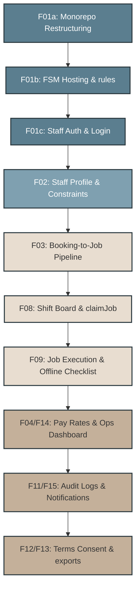

# FSM Platform Project Roadmap
**Version:** 1.0  
**Date:** June 13, 2026  
**Primary Epic Source:** [FreshNestCo_FSM_Plan_v2.md](file:///workspaces/fresh_nest/docs/FreshNestCo_FSM_Plan_v2.md)

This roadmap breaks down the Field Service Management (FSM) platform implementation into a series of modular, sequential **Project Specifications** designed for an autonomous AI-agent developer workflow.

---

## Architectural Decisions & Strategy Alignment

During the planning phase, the following core decisions were established:
1. **Phased Rollout:** Partition implementation into four sequential phases (Bootstrapping, Staff Foundation, Job Lifecycle, and Admin/Compliance).
2. **Monorepo Workspace:** Transition the flat repository to a native `npm workspaces` monorepo. Keep `packages/shared` empty initially, copying config files to avoid premature abstraction.
3. **Admin-Driven Enrollment:** Ryan/Lauren will enroll staff via an admin modal. Staff members authenticate using verified emails on the FSM portal (email/password or magic link).
4. **Admin UI Consolidation:** All admin-facing tools (checklist template editing, pay rate scheduling, operations dashboards, audit logs) live in the existing Customer App Admin Panel, leveraging Google OAuth.
5. **Secure Claiming:** Implement a secure `claimJob` Cloud Function to validate scheduling constraints (earnings caps, travel buffers, blocked windows) and update assignment transactionally.
6. **Offline Photo Uploads:** Queue camera photos as Blobs in IndexedDB when offline, uploading them automatically when network connection is restored.

---

## Dependency Graph

---

## Project Specifications Map

### Phase 1 — Infrastructure & Authentication
| Project ID | Title | Scope | Deliverable | Target Files |
| :--- | :--- | :--- | :--- | :--- |
| **[F01a](file:///workspaces/fresh_nest/docs/projects/F01a_monorepo-workspaces.md)** | Monorepo Workspace Setup | Restructure the repository layout into `apps/customer`, `apps/fsm`, and `packages/shared`. | Functional npm workspaces, dual-build configuration. | `package.json`, `apps/*`, `tsconfig.json` |
| **[F01b](file:///workspaces/fresh_nest/docs/projects/F01b_fsm-hosting-setup.md)** | FSM Hosting & rules | Register the hosting target, define environment config, and extend Firestore rules. | Firebase Hosting FSM target, Firestore security rules. | `firebase.json`, `.firebaserc`, `firestore.rules` |
| **[F01c](file:///workspaces/fresh_nest/docs/projects/F01c_staff-authentication.md)** | Staff Auth System | Build authentication workflow for cleaners using email/password and passwordless magic links. | `useStaffAuth` hook, Login interface, route guards. | `apps/fsm/src/components/auth/*` |

### Phase 2 — Staff Foundation
| Project ID | Title | Scope | Deliverable | Target Files |
| :--- | :--- | :--- | :--- | :--- |
| **[F02](file:///workspaces/fresh_nest/docs/projects/F02_staff-profiles-constraints.md)** | Staff Profile & Settings | Add profile dashboard with monthly earnings cap, travel buffers, and blocked calendar windows. Admin modal to register staff. | Profile UI, constraint inputs, admin creation modal. | `apps/fsm/src/pages/ProfilePage.tsx`, `apps/customer/...` |

### Phase 3 — Job Lifecycle & Pipeline
| Project ID | Title | Scope | Deliverable | Target Files |
| :--- | :--- | :--- | :--- | :--- |
| **[F03](file:///workspaces/fresh_nest/docs/projects/F03_booking-job-pipeline.md)** | Booking-to-Job Pipeline | Cloud Function to create Jobs from confirmed bookings. Admin UI to manage checklist templates. | `onBookingStatusConfirmed` trigger, template CRUD. | `functions/src/index.ts`, `apps/customer/...` |
| **[F08](file:///workspaces/fresh_nest/docs/projects/F08_shift-board-claiming.md)** | Shift Board & `claimJob` | Available shifts board with constraint matching. Cloud Function to claim shifts transactionally. | Shift Board UI, `claimJob` transaction cloud function. | `apps/fsm/src/pages/ShiftBoardPage.tsx`, `functions/...` |
| **[F09](file:///workspaces/fresh_nest/docs/projects/F09_job-execution-offline.md)** | Job Execution & Offline PWA | Cleaner check-in/out, checklist tasks, IndexedDB photo queueing, and Firebase Storage integration. | PWA Job execution page, offline upload manager. | `apps/fsm/src/pages/JobPage.tsx`, `apps/fsm/src/main.tsx` |

### Phase 4 — Operations & Compliance
| Project ID | Title | Scope | Deliverable | Target Files |
| :--- | :--- | :--- | :--- | :--- |
| **[F04/F14](file:///workspaces/fresh_nest/docs/projects/F04_F14_pay-rates-ops.md)** | Pay Rates & Ops Dashboard | Manage pay rates per role. Add completed job operational analytics to the admin dashboard. | Pay Rates manager UI, Operations intelligence dashboard. | `apps/customer/src/components/admin/...` |
| **[F11/F15](file:///workspaces/fresh_nest/docs/projects/F11_F15_audit-notifications.md)** | Audit Logs & SMS Alerts | Admin audit logs UI. Cloud Functions to trigger bilingual SMS notifications on shift status changes. | Audit Log UI, automated SMS trigger handlers. | `functions/src/sms.ts`, `apps/customer/...` |
| **[F12/F13](file:///workspaces/fresh_nest/docs/projects/F12_F13_terms-compliance.md)** | Terms Consent & exports | Mandatory Terms of Service consent gate on login. Admin export for employment/payroll logs. | Terms overlay component, CSV payroll exporter. | `apps/fsm/src/components/...`, `apps/customer/...` |

---

## Guidelines for AI Execution of Projects
- **Persona Alignment:** Always inspect `docs/PERSONAS.md` before coding. Ensure Margaret's accessible tap targets (48px) and Diane/Sophie's bilingual output are fully respected.
- **Rules Verification:** Before closing a project, run the `Brand_Auditor`, `Data_Steward`, and `Linguistic_Auditor` checklists (specified in `GEMINI.md`).
- **Tests Execution:** Ensure `npm run build` and tests compile clean before transitioning to the next project.
